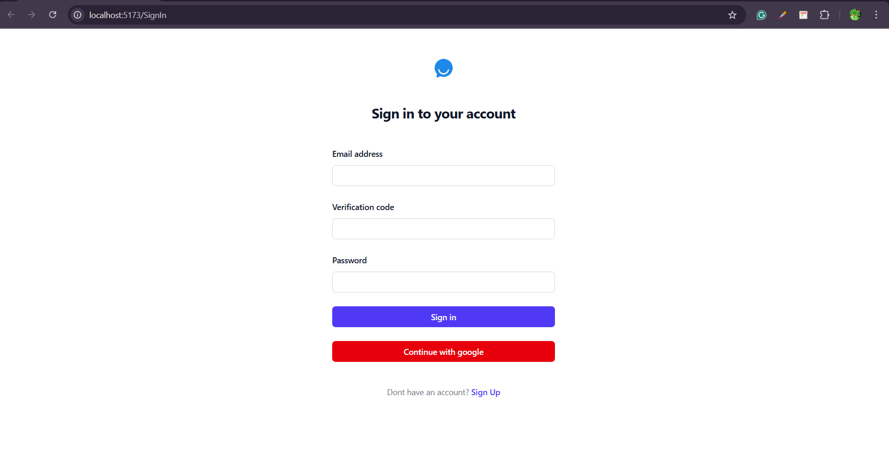
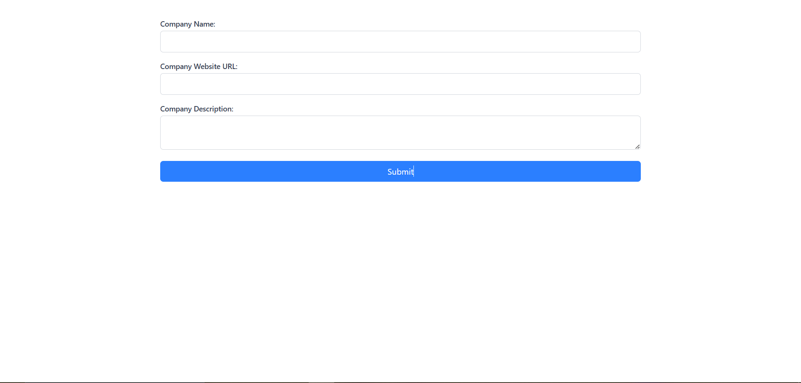
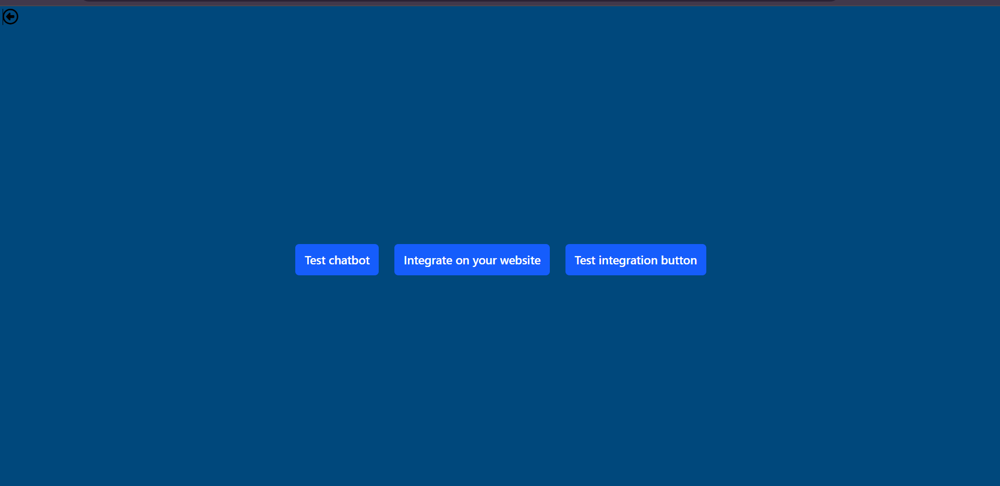
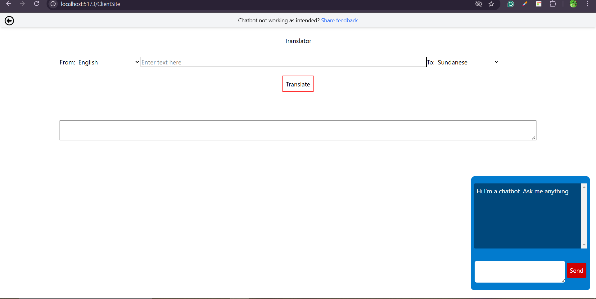
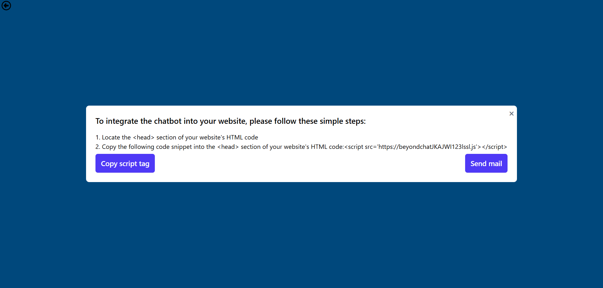
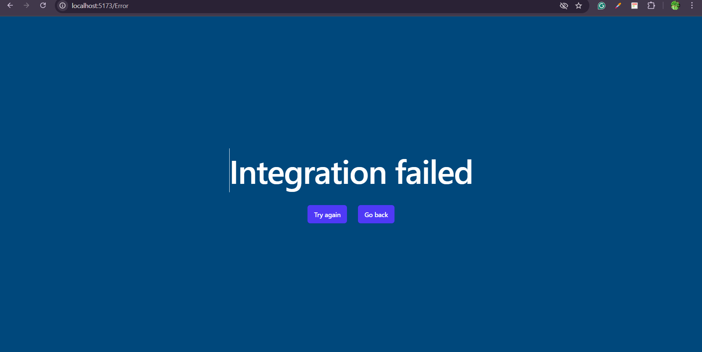
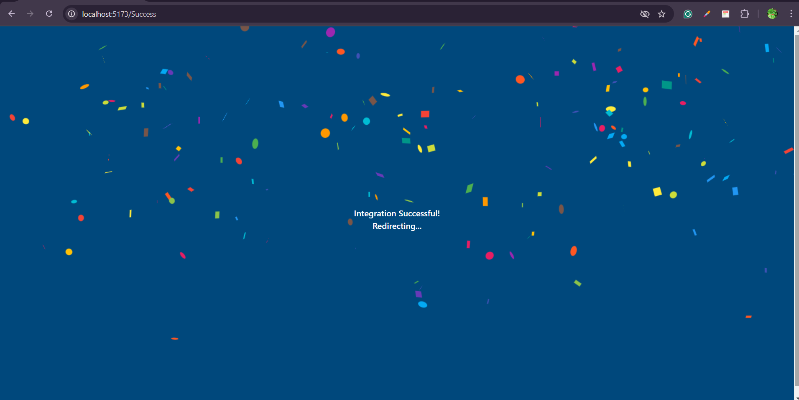
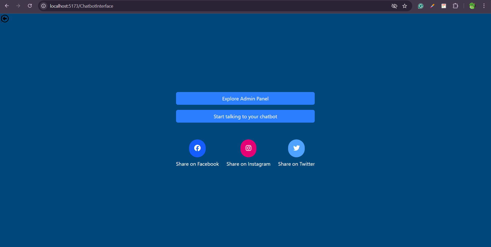

# Documentation

This is a React application built as a demo for a chatbot integration website. The application uses Firebase Authentication for user sign-in and sign-up, and integrates with a backend (not implemented) to handle tasks like scraping webpages, and training a chatbot.

## Live Demo

You can view the live demo of the application here:

[Live Demo -](https://beyond-chats-phi.vercel.app/)

## Features

- **User Registration**

  - Users can sign up with name, email, and password.
  - Users can also sign up using Google authentication.
  - Firebase email verification (note: email verification code can be any value or left blank, as google firebase doesn't have this feature, custom verification logic needs to be implemented on custom backend).

- **Setup Organisation**

  - Users can enter company name, website URL, and description.
  - Dummy data is used to display scraped webpages, with statuses showing which pages have been scraped and which are pending.

- **Chatbot Integration & Testing**
  - **Test Chatbot**: Opens a dummy chatbot integration on the client's website.
  - **Integrate on Website**: Provides easy-to-follow instructions for integrating the chatbot code into the website.
  - **Test Integration**: Opens a new screen to test the integration.

## Tech Stack

- **Frontend**: React 18, React Router, TailwindCSS
- **Authentication**: Firebase Authentication
- **Styling**: TailwindCSS
- **UI Components**: React Confetti, React Spinners
- **Other Dependencies**:
  - `@google/generative-ai`: For integrating gemini chatbot.
  - `firebase`: For Firebase Authentication services.
  - `react-router-dom`: For handling routing within the app.

## Screenshots

User Registration



Setup Organisation



Chatbot integration & testing



Chatbot integration in client's site



Chatbot integration instructions



Integration fail



Integration success



Chatbot menu




## Environment Variables

To run this project, you will need to add the following environment variables to your .env file

`VITE_API_KEY`

## Run Locally

Clone the project

```bash
  git clone https://github.com/BraveAnarchist/BeyondChats
```

Go to the project directory

```bash
  cd BeyondChats
```

Install dependencies

```bash
  npm install
```

Start the server

```bash
  npm run dev
```
